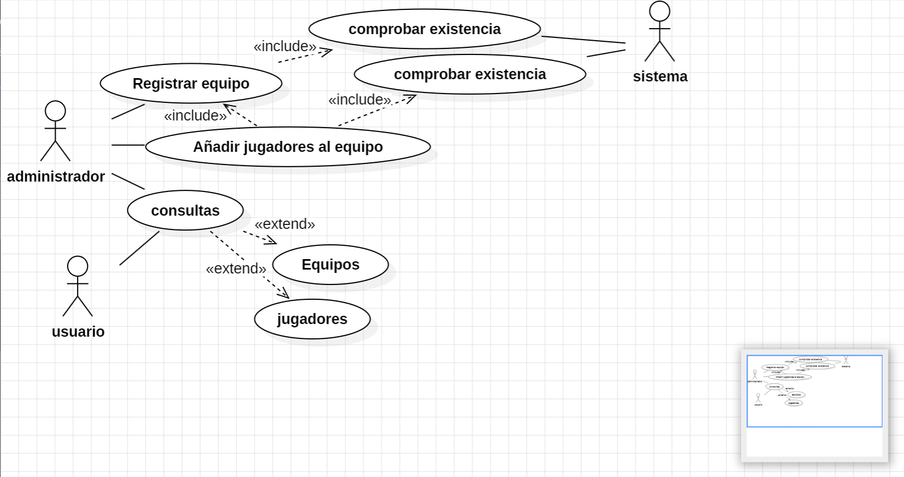
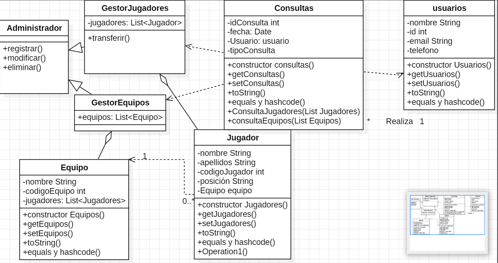

# AD3-DiagramasUML
Este proyecto corresponde a la Actividad 3 de la asignatura *Entornos de Desarrollo*.  
El objetivo principal es diseñar, mediante el lenguaje UML, un sistema para la gestión de jugadores y equipos dentro de un torneo.  

Para ello, se han elaborado diagramas de **casos de uso** y **clases**, que permiten representar tanto las funcionalidades del sistema como su estructura interna. El diseño incluye la intervención de distintos actores (administrador, usuario y sistema) y contempla procesos como el registro de equipos, la incorporación de jugadores y la consulta de información.
## 1. Diagrama de Casos de Uso

### Descripción de los casos de uso:

- **Registrar equipo**: El administrador introduce un nuevo equipo en el sistema.  
- **Añadir jugador**: El administrador añade un jugador a un equipo ya existente.  
- **Consultar jugadores**: El usuario consulta información sobre jugadores registrados.  
- **Consultar equipos**: El usuario accede a información de los equipos disponibles.  
- **Verificación del sistema**: El sistema comprueba si el equipo o jugador ya existen antes de registrar.
- ## 2. Diagrama de Clases UML

### Explicación de la estructura:

El sistema está estructurado en torno a las siguientes clases:
-**Administrador**:`Clase abstracta.
- **Gestores**: `GestorEquipos`, `GestorJugadores`. 
- **Entidades**: Clases `Equipo`, `Jugador`, `Usuarios`,`consultas`.

Las relaciones incluyen:
- Herencia: las clases GestorJugadores y GestorEquipos heredan métodos  de la clase abstracta administrador.
- Asociación: Equipo y jugador tienen una relación de asociación con cada uno de sus gestores. 
- Dependencia: Jugador tiene una relación de dependencia con equipo ya que por si solo no puede existir.
- Dependencia: Consultas tiene una relación de dependencia con los gestores y con usuarios ya que sin ellos no puede existir.
  

---

## 3. Justificación del Diseño

Se eligió una arquitectura modular basada en gestores para separar responsabilidades. Esto mejora la escalabilidad, el mantenimiento y la legibilidad del código.
-**Administrador**: La clase Administrador es abstracta y sirve como base para los gestores. Contiene métodos comunes para registrar, modificar y eliminar entidades, como jugadores y equipos. Esta clase facilita la reutilización de código y asegura que las funcionalidades básicas estén centralizadas.
- **GestorJugadores**: GestorJugadores hereda de Administrador y se encarga de gestionar a los jugadores dentro del sistema. Además de los métodos comunes heredados (registrar, modificar, eliminar), incluye un método propio para transferir jugadores entre equipos, lo que permite una operación más específica y compleja.
- **GestorEquipos**:GestorEquipos también hereda de Administrador y se especializa en gestionar equipos. Proporciona las funcionalidades necesarias para registrar, modificar, eliminar y consultar equipos, garantizando que todas las operaciones sobre equipos estén centralizadas en esta clase. 
- **Jugador**: La clase Jugador representa a los jugadores dentro del sistema. Cada jugador tiene atributos específicos que definen su identidad y estado (por ejemplo, nombre, posición, equipo al que pertenece, etc.). Esta clase no tiene métodos complejos, ya que su función principal es almacenar datos relevantes sobre cada jugador.
- **Equipo**:La clase Equipo representa a los equipos dentro del sistema. Similar a la clase Jugador, Equipo almacena atributos clave como el nombre del equipo, los jugadores que lo componen y otros datos relevantes para la gestión de los equipos.
- **Usuarios**:La clase Usuario representa a los usuarios del sistema, quienes pueden ser personas que consultan información sin alterar los datos del sistema. Los usuarios tienen acceso a las Consultas, pero no pueden realizar modificaciones en los datos de los jugadores ni de los equipos.

- **Consultas**: Consultas es una clase que permite a los usuarios acceder a la información del sistema sin modificarla. A través de Consultas, los usuarios pueden obtener detalles sobre jugadores, equipos y otros elementos del sistema, pero sin alterar la base de datos ni las entidades.

---

## 4. Conclusiones

Durante la realización de esta actividad:

- Aprendí a modelar un sistema con múltiples actores y responsabilidades claras.
- Comprendí la importancia de los diagramas UML para planificar antes de codificar.

